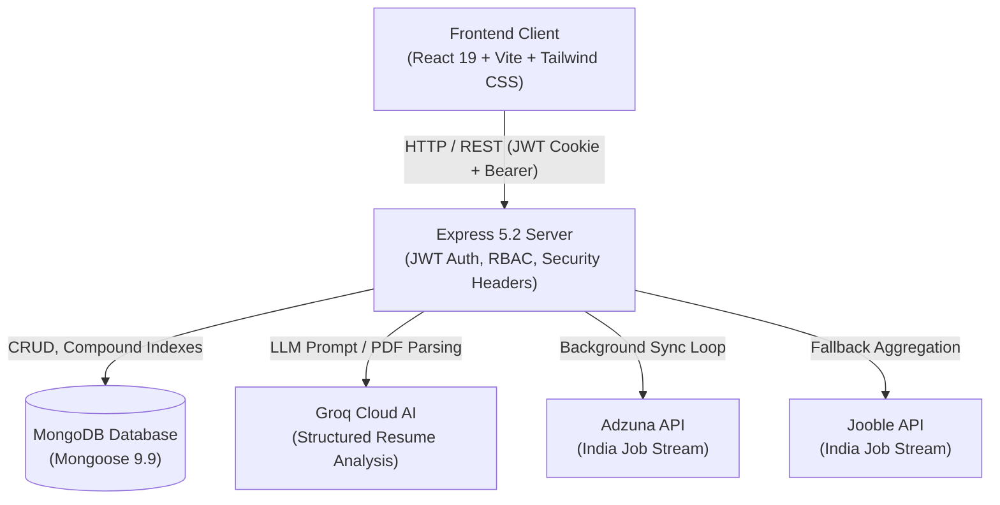

# JobSphere — Full-Stack Job Portal & AI Resume Intelligence Platform

A modern, production-grade Job Portal web application built on the MERN stack with React 19, Express 5, MongoDB, and Tailwind CSS. Features role-based career management for candidates and recruiters, automated multi-provider external job ingestion (Adzuna & Jooble), and AI-driven resume scoring via Groq LLM integration.

---

## Architecture Overview



---

## Tech Stack

- **Frontend:** React 19, Vite 8, Tailwind CSS 4, Framer Motion 12, Lucide Icons, Axios.
- **Backend:** Node.js (ESM), Express 5.2, Mongoose 9.9, Multer, Bcrypt.js, JsonWebToken, Google Auth Library.
- **External Providers:** Adzuna Job Search API, Jooble India API, Groq AI (`openai/gpt-oss-120b` & `llama-3.3-70b-versatile`).
- **DevOps & Containers:** Docker, Docker Compose, Node built-in test runner (`node:test`).

---

## Key Features

### 1. Job Seeker (Student) Flow
- **Global Search & Filter:** Filter jobs by keyword, location, job type (Full-time, Remote, Part-time), and salary ranges.
- **Unified Catalog:** Browse both internally posted recruiter jobs and aggregated external jobs with direct apply links.
- **Job Applications:** Track application status in real-time (`Pending`, `Accepted`, `Rejected`) with duplicate submission prevention.
- **AI Resume Analyzer:** Upload PDF or Word documents to receive real-time parsing, ATS compatibility scores, skill breakdown, and resume enhancement recommendations.
- **Social OAuth:** One-click Google and GitHub OAuth authentication and profile linking.

### 2. Recruiter (Employer) Flow
- **Company Management:** Register company profiles, logos, descriptions, and verified website links.
- **Job Posting:** Create customized listings with structured requirements, salary ranges, experience tiers, and locations.
- **Candidate Pipeline:** View candidate submissions, contact details, uploaded resumes, and update decision statuses.
- **Optimized Ingestion:** Consolidated candidate queries eliminate N+1 dashboard loading bottlenecks.

### 3. Security & Reliability
- **Zero-Trust JWT Verification:** Strict verification with dual cookie and `Authorization: Bearer <token>` transport.
- **Server-Side RBAC:** Middleware role guards (`student`, `recruiter`, `admin`) preventing privilege escalation.
- **IDOR Prevention:** Server-side ownership validation ensuring recruiters only modify their own companies and jobs.
- **Sliding-Window Rate Limiting:** In-memory request throttling on login, registration, and file upload endpoints.
- **Memory Safety:** Multer upload limits (5MB) and strict MIME type allowlisting preventing heap exhaustion.
- **Database Indexing:** Compound unique index on `{ job: 1, applicant: 1 }` prevents race-condition duplicate applications.

---

## Directory Structure

```
Job-Portal/
├── backend/
│   ├── controllers/      # Route controllers (user, job, company, application, externalJob)
│   ├── middlewares/      # isAuthenticated, authorizeRole, rateLimit, errorHandler, multer
│   ├── models/           # Mongoose schemas with compound indexes
│   ├── providers/        # External job provider implementations (Adzuna, Jooble)
│   ├── routes/           # Express route definitions
│   ├── services/         # External job sync, Groq analyzer, deduplicator, rateLimiter
│   ├── test/             # Automated unit tests using node:test
│   ├── utils/            # DB connection, validators, currency converters, resume parsers
│   ├── index.js          # Express entry point
│   └── package.json
├── frontend/
│   ├── src/
│   │   ├── services/     # Centralized Axios API client with 401 interceptors
│   │   ├── context/      # ThemeContext (Dark / Light mode)
│   │   ├── JobPortal.jsx # Public job catalog & search
│   │   ├── JobPortalApplicantView.jsx # Candidate portal & application tracking
│   │   ├── JobPortalRecruiterView.jsx # Recruiter dashboard & candidate pipeline
│   │   ├── JobPortalResumeAnalyzer.jsx # AI resume parsing interface
│   │   ├── JobPortalAuth.jsx # Authentication & social login
│   │   └── App.jsx       # Root view router
│   └── package.json
├── docs/adr/             # Architecture Decision Records
└── docker-compose.yml    # Container orchestration
```

---

## Prerequisites

- **Node.js:** v18.0.0 or higher (v20+ recommended)
- **MongoDB:** MongoDB Atlas connection string or local MongoDB instance (v6.0+)
- **npm:** v9.0.0 or higher

---

## Getting Started

### 1. Clone & Configure Environment

Copy the example environment files in `backend`:

```bash
cd backend
cp .env.example .env
```

Configure your `.env` variables:

```env
PORT=8000
NODE_ENV=development
CLIENT_ORIGIN=http://localhost:5173
MONGO_URI=mongodb+srv://<user>:<password>@cluster0.example.mongodb.net/jobportal
SECRET_KEY=your_secure_jwt_secret_key

# Optional OAuth & External APIs
GOOGLE_CLIENT_ID=your_google_client_id
GOOGLE_CLIENT_SECRET=your_google_client_secret
GITHUB_CLIENT_ID=your_github_client_id
GITHUB_CLIENT_SECRET=your_github_client_secret
ADZUNA_APP_ID=your_adzuna_app_id
ADZUNA_APP_KEY=your_adzuna_app_key
JOOBLE_API_KEY=your_jooble_api_key
GROQ_API_KEY=your_groq_api_key
```

### 2. Install Dependencies

In the `backend` directory:
```bash
cd backend
npm install
```

In the `frontend` directory:
```bash
cd ../frontend
npm install
```

### 3. Run Development Servers

**Start Backend (Port 8000):**
```bash
cd backend
npm run dev
```

**Start Frontend (Port 5173):**
```bash
cd frontend
npm run dev
```

Open [http://localhost:5173](http://localhost:5173) in your browser.

---

## Running with Docker Compose

To run the entire stack in isolated containers:

```bash
docker compose up --build
```

- Frontend: [http://localhost:5173](http://localhost:5173)
- Backend: [http://localhost:8000](http://localhost:8000)

---

## Testing

The project includes an offline-capable automated test suite using Node's built-in test runner (`node:test`):

```bash
cd backend
npm test
```

To run external provider integration tests (requires network & configured API keys):
```bash
npm run test:live
```

---

## API Endpoints Reference

### Authentication & Users (`/api/v1/user`)
| Method | Endpoint | Access | Description |
| :--- | :--- | :--- | :--- |
| `POST` | `/register` | Public | Register new student or recruiter |
| `POST` | `/login` | Public | Authenticate user, receive JWT cookie & token |
| `GET` | `/logout` | Public | Clear authentication cookie |
| `GET` | `/me` | Authenticated | Fetch current profile |
| `POST` | `/profile/update` | Authenticated | Update user bio, skills, and contact info |
| `POST` | `/analyze-resume`| Authenticated | Upload resume file for AI extraction & scoring |
| `POST` | `/auth/google` | Public | Google OAuth login / account linking |
| `GET` | `/auth/github/callback` | Public | GitHub OAuth redirect handler |

### Job Management (`/api/v1/job`)
| Method | Endpoint | Access | Description |
| :--- | :--- | :--- | :--- |
| `GET` | `/get` | Public | Paginated job list with keyword filtering |
| `GET` | `/get/:id` | Public | Get single job details (internal or external) |
| `POST` | `/post` | Recruiter, Admin | Create a new job posting |
| `GET` | `/getadminjobs` | Recruiter, Admin | Get all jobs posted by logged-in recruiter |

### Company Management (`/api/v1/company`)
| Method | Endpoint | Access | Description |
| :--- | :--- | :--- | :--- |
| `POST` | `/register` | Recruiter, Admin | Register a new employer company |
| `GET` | `/get` | Authenticated | Get companies owned by logged-in user |
| `GET` | `/get/:id` | Authenticated | Get company by ID |
| `PUT` | `/update/:id` | Recruiter, Admin | Update company info (ownership enforced) |

### Applications (`/api/v1/application`)
| Method | Endpoint | Access | Description |
| :--- | :--- | :--- | :--- |
| `POST` | `/apply/:id` | Student | Apply to a job posting (atomic duplicate protection) |
| `GET` | `/get` | Authenticated | View current candidate's applied jobs |
| `GET` | `/recruiter/all`| Recruiter, Admin | Consolidated candidate pipeline across all recruiter jobs |
| `GET` | `/:id/applicants`| Recruiter, Admin | View applicants for a specific job (owner verified) |
| `POST` | `/status/:id/update` | Recruiter, Admin | Accept or reject application status |

---

## License

ISC License. Built for portfolio presentation and production readiness.
